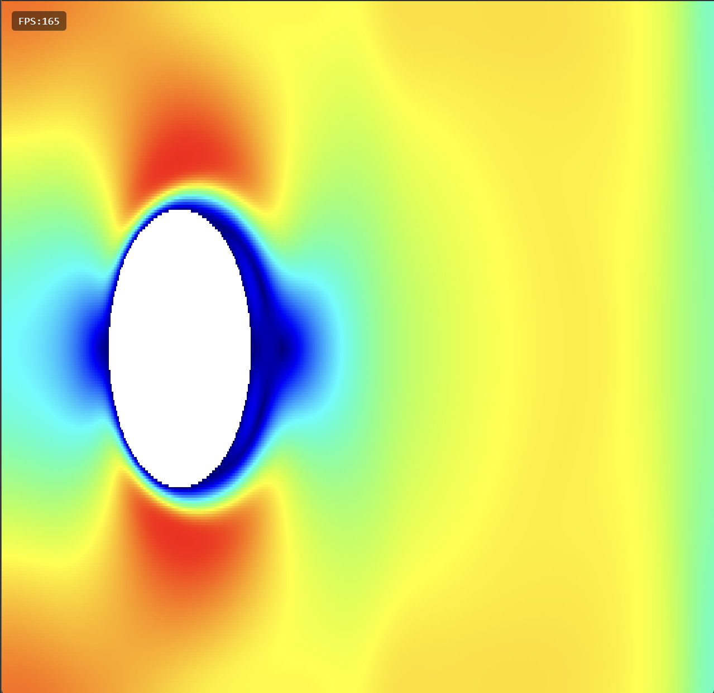
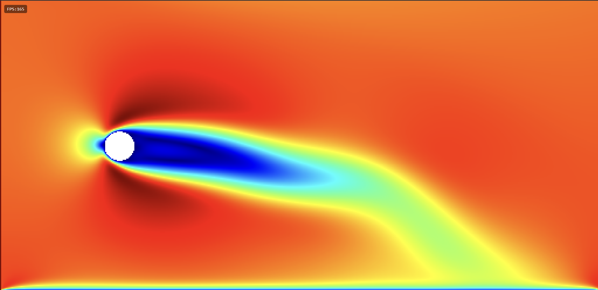

# Lattice Boltzmann Method
the **Lattice Boltzmann Method** is a way to simulate fluids like air in this case. Instead of tracking billions of molecules or Navier Stroke equations we use grids to hold cells of fluid particles moving in few fixed directions.
## D2Q9
**D2** = 2 dimensions; **Q9** = 9 discrete directions, 

	

- $f_0$: Fluid staying still (velocity $\vec{e}_0 = (0,0)$).
- $f_1, f_2, f_3, f_4$: Fluid moving along the cardinal axes (Right, Up, Left,  Down).   
- $f_5, f_6, f_7, f_8$: Fluid moving along the diagonals (NE, NW, SW, SE).
Each $f_i$ is basically how much mass of that fluid is moving in that direction ($i$).
## Weights
when the fluid sits still, the particles distribute in all 9 directions:
- **Rest ($i=0$):** $w_0 = 4/9$ (most mass stays in place).
- **Cardinals ($i=1..4$):** $w_i = 1/9$ each (equal split across standard directions).
- **Diagonals ($i=5..8$):** $w_i = 1/36$ each (smaller share because moving diagonally covers more distance on the grid).

$$\sum_{i=0}^8 w_i = \frac{4}{9} + 4\left(\frac{1}{9}\right) + 4\left(\frac{1}{36}\right) = 1$$
## Equilibrium Distribution
if we push a fluid at an overall macroscopic density $\rho$ and velocity $v$, $f_i^{eq}$ is the balance of how much fluid should naturally be traveling along each of the 9 directions.

$$f_i^{eq} = w_i \cdot \rho \cdot \left[ 1 + 3(\vec{e}_i \cdot \vec{u}) + \frac{9}{2}(\vec{e}_i \cdot \vec{u})^2 - \frac{3}{2}(\vec{u} \cdot \vec{u}) \right]$$
- **$\vec{e}_i \cdot \vec{u}$ (Directional alignment):** The dot product. If direction $i$ points in the same direction the fluid is moving, this term is positive, allocating more fluid in that direction.
- **$(\vec{e}_i \cdot \vec{u})^2$ (Inertia/Kinetic term):** Accounts for non-linear momentum at higher velocities.
- **$\vec{u} \cdot \vec{u} = u_x^2 + u_y^2$ (Speed correction):** Subtracts kinetic energy so overall mass is preserved regardless of how fast the fluid moves.
## Macroscopic Reconstruction
Once a simulation is running, all 9 $f_i$ values inside a cell change. To convert those 9 numbers back into the fluid properties density and velocity, using simple summations:
### Total density ($\rho$)
$$\rho = \sum_{i=0}^8 f_i = f_0 + f_1 + f_2 + \dots + f_8$$
### Momentum ($\rho \vec{u}$)
$$\rho \vec{u} = \sum_{i=0}^8 f_i \vec{e}_i$$
### Velocity ($\vec{v}$)
$$\vec{u} = \frac{\rho \vec{u}}{\rho}$$
# Collision
With just the LB simulation particles are just stuck, so we need to simulate and add collision to static objects. Collision is where particles bump into each other, exchange momentum, and create fluid behavior like viscosity, drag, and vortices.
## Bhatnagar-Gross-Krook
The **BGK** equation approximation relaxes he current distribution $f_i$ toward its local equilibrium $f_i^{eq}$ 
$$f_i^{\text{new}} = f_i - \frac{1}{\tau} \left( f_i - f_i^{eq} \right) = \left(1 - \frac{1}{\tau}\right) f_i + \frac{1}{\tau} f_i^{eq}$$
In this $(f_i - f_i^{eq})$ is how far off balance the fluid packet is and $\frac{1}{\tau}$ represents how much of that imbalance gets corrected in a single time step.
### Tau ($\tau$)
$\tau$ controls how quickly a cell "forgets" its current state and relaxes into equilibrium.
#### Kinematic viscosity ($\nu$)
$$\nu = \frac{1}{3}\left(\tau - \frac{1}{2}\right)$$
- **$\tau \to 0.5$ ($\nu \to 0$):** Very low viscosity (water, air). The fluid forms sharp, swirling eddies and turbulent vortex streets, but becomes numerically fragile (can blow up to `NaN` if velocity gets too high).
- 
- **$\tau \approx 0.6 - 1.0$:** Moderate viscosity (oil). Smooth, stable, and visually responsive.    
- **$\tau > 1.5$:** High viscosity (honey, molasses). Heavy damping that quickly smooths out disturbances.
# Streaming
Streaming step turns static equilibrium grid into an active time-stepping simulation. In real physics, fluid packets travel forward. So we have to figure out at the pixel "which neighbor sent fluid in direction $\vec{e}_i$ that arrives at my cell right now?",  the fluid arriving at cell $\vec{x}$ in direction $\vec{e}_i$ had to come from the upstream neighbor at $\vec{x} - \vec{e}_i$ .
$$f_i^{\text{streamed}}(\vec{x}) = f_i^{\text{post-collision}}(\vec{x} - \vec{e}_i)$$
## Grid Offsets to UV Space
UV coordinates run form `0.0` to `1.0` , so shifting UVs by 1 cell means shifting by1 texel.
$$\text{texelSize} = \left( \frac{1}{\text{width}}, \frac{1}{\text{height}} \right)$$
To pull direction $\vec{e}_i = (e_x, e_y)$, sample the texture at:

$$\text{UV}_{\text{sample}} = \text{vUv} - \vec{e}_i \cdot \text{texelSize}$$

- **Direction $f_1$ ($+x$, moving Right):** Pull from Left $\rightarrow$ `vUv - vec2(1.0, 0.0) * texelSize`
- **Direction $f_3$ ($-x$, moving Left):** Pull from Right $\rightarrow$ `vUv - vec2(-1.0, 0.0) * texelSize
- **Direction $f_2$ ($+y$, moving Up):** Pull from Down $\rightarrow$ `vUv - vec2(0.0, 1.0) * texelSize`
- **Direction $f_5$ ($+x, +y$, moving NE):** Pull from SW $\rightarrow$ `vUv - vec2(1.0, 1.0) * texelSize`
# Bounce-Back
Right now we have initialized all cells with uniform density $\rho=1.0$ and uniform velocity $\vec{u}=(0.1, 0)$. We need to add an **obstacle mask with bounce-back boundary condition**.
## Momentum Inversion
In real fluid dynamics, when viscous fluid contacts a solid wall, molecular collisions reflect incoming particles directly backward.

In LBM, each discrete direction vector $\vec{e}_i$ has an exact opposite vector.

$$\vec{e}_{\bar{i}} = -\vec{e}_i$$

- If fluid leaves a fluid cell travelling toward a wall along direction $\vec{e}_i$, it hits the boundary halfway to the solid node and reflects directly back along direction $\vec{e}_{\bar{i}}$ into the same fluid cell.
- Because the outgoing momentum $+\vec{e}_i$ and incoming reflected momentum $-\vec{e}_i$ cancel out, the net velocity at the boundary interface averages exactly to zero:

$$\vec{u}_{\text{wall}} = \frac{1}{2}(\vec{u}_{\text{incident}} + \vec{u}_{\text{reflected}}) = \mathbf{0}$$
## Obstacle Mask
Let $M(\vec{x})$ be an obstacle mask defined across the grid:

$$M(\vec{x}) = \begin{cases} 1.0 & \text{if cell } \vec{x} \text{ is a solid obstacle / wall} \\ 0.0 & \text{if cell } \vec{x} \text{ is fluid} \end{cases}$$

When computing the incoming distribution $f_i^{\text{new}}(\vec{x})$ at the current cell $\vec{x}$:
1. Check the upstream neighbor cell $\vec{x}_{\text{upstream}} = \vec{x} - \vec{e}_i$.
2. **If upstream is FLUID ($M(\vec{x} - \vec{e}_i) == 0.0$):**
    Pull normally from the neighbor's post-collision state in the same direction:
    $$f_i^{\text{new}}(\vec{x}) = f_i^{\text{post-coll}}(\vec{x} - \vec{e}_i)$$
3. **If upstream is SOLID ($M(\vec{x} - \vec{e}_i) == 1.0$):**
    Do not read from the solid cell. Instead, take your **own cell's** post-collision distribution in the **opposite direction** $\bar{i}$:
    $$f_i^{\text{new}}(\vec{x}) = f_{\bar{i}}^{\text{post-coll}}(\vec{x})$$

$$\boxed{f_i^{\text{new}}(\vec{x}) = \left[ 1 - M(\vec{x} - \vec{e}_i) \right] \cdot f_i^{\text{post-coll}}(\vec{x} - \vec{e}_i) + M(\vec{x} - \vec{e}_i) \cdot f_{\bar{i}}^{\text{post-coll}}(\vec{x})}$$
# Result: Phase 1

	

Right now there is no outlet for the fluid to escape, or an inlet. That is the next step.
# Boundary Conditions
When you stream distributions across the grid, fluid packets move one step along their lattice vectors $\vec{e}_i$: 

$$f_i(\vec{x}, t + \Delta t) = f_i^*(\vec{x} - \vec{e}_i, t)$$

At any boundary, this equation breaks down because the upstream coordinate $\vec{x} - \vec{e}_i$ lies outside the simulation domain and because macroscopic density and velocity depend on having all 9 directions
$$\rho = \sum_{i=0}^8 f_i, \qquad \rho \vec{u} = \sum_{i=0}^8 f_i \vec{e}_i$$

The boundary condition must construct the missing distributions ($f_1, f_5, f_8$) so that the resulting macroscopic velocity matches desired inlet speed $\vec{u}_{\text{inlet}}$.
## Inlet Theory
There are two ways to reconstruct the missing inlet distributions.
### Equilibrium Dirichlet Condition
The direct approach assumes that because the inlet is infinitely far upstream from disturbances, the incoming state at $x = 0$ is in pure equilibrium at density $\rho_0 = 1.0$ and velocity $\vec{u}_{\text{inlet}} = (u_0, 0)$:

$$f_i(0, y) = f_i^{\text{eq}}(\rho = 1.0, \, \vec{u} = \vec{u}_{\text{inlet}})$$
## Outlet Theory
At the right boundary ($x = W - 1$), fluid packets moving leftward ($f_3, f_6, f_7$) are missing because they would have to come from $x \ge W$. If we simply leave them empty or bounce them back, create a solid wall that reflects pressure waves back into the domain, destroying the wake patterns.

To let vortices leave the simulation without artificial reflections, the boundary should satisfy a continuous Sommerfeld radiation (or convective) condition:

$$\frac{\partial f_i}{\partial t} + U_{\text{conv}} \frac{\partial f_i}{\partial x} = 0$$

where $U_{\text{conv}}$ is the speed at which structures move downstream. Though for very fast speed changes the acoustic collisions.

To fix that we have to do two thing add Sponge Layers to absorb these sudden fast waves of air or ramp the inlet velocity with a target velocity to hit. And the end result look like this.

	

