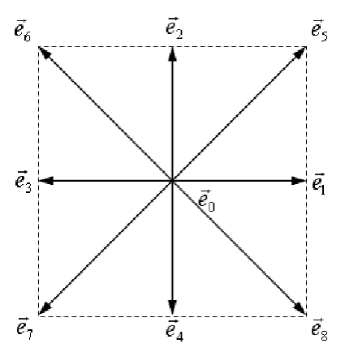

the **Lattice Boltzman Method** is a way to simulate fuids like air in this case. Instead of tracking billions of molecules or Navier Stroke equations we use grids to hold cells of fluid particles moving in few fixed directions.
## D2Q9
**D2** = 2 dimensions; **Q9** = 9 discrete directions, 

	

- $f_0$: Fluid staying still (velocity $\vec{e}_0 = (0,0)$).
- $f_1, f_2, f_3, f_4$: Fluid moving along the cardinal axes (Right, Up, Left,  Down).   
- $f_5, f_6, f_7, f_8$: Fluid moving along the diagonals (NE, NW, SW, SE).
Each $f_i$ is basically how much mass of that fluid is moving in that direction ($i$).
## Weights
when the fluid sits still, the particles distribute in all 9 directions:
- **Rest ($i=0$):** $w_0 = 4/9$ (most mass stays in place).
- **Cardinals ($i=1..4$):** $w_i = 1/9$ each (equal split across standard directions).
- **Diagonals ($i=5..8$):** $w_i = 1/36$ each (smaller share because moving diagonally covers more distance on the grid).

$$\sum_{i=0}^8 w_i = \frac{4}{9} + 4\left(\frac{1}{9}\right) + 4\left(\frac{1}{36}\right) = 1$$
## Equilibrium Distribution
if we push a fluid at an overall macroscopic density $\rho$ and velocity $v$, $f_i^{eq}$ is the balance of how much fluid should naturally be traveling along each of the 9 directions.

$$f_i^{eq} = w_i \cdot \rho \cdot \left[ 1 + 3(\vec{e}_i \cdot \vec{u}) + \frac{9}{2}(\vec{e}_i \cdot \vec{u})^2 - \frac{3}{2}(\vec{u} \cdot \vec{u}) \right]$$
- **$\vec{e}_i \cdot \vec{u}$ (Directional alignment):** The dot product. If direction $i$ points in the same direction the fluid is moving, this term is positive, allocating more fluid in that direction.
- **$(\vec{e}_i \cdot \vec{u})^2$ (Inertia/Kinetic term):** Accounts for non-linear momentum at higher velocities.
- **$\vec{u} \cdot \vec{u} = u_x^2 + u_y^2$ (Speed correction):** Subtracts kinetic energy so overall mass is preserved regardless of how fast the fluid moves.
## Macroscopic Reconstruction
Once a simulation is running, all 9 $f_i$ values inside a cell change. To convert those 9 numbers back into the fluid properties density and velocity, using simple summations:
### Total density ($\rho$)
$$\rho = \sum_{i=0}^8 f_i = f_0 + f_1 + f_2 + \dots + f_8$$
### Momentum ($\rho \vec{u}$)
$$\rho \vec{u} = \sum_{i=0}^8 f_i \vec{e}_i$$
### Velocity ($\vec{v}$)
$$\vec{u} = \frac{\rho \vec{u}}{\rho}$$
